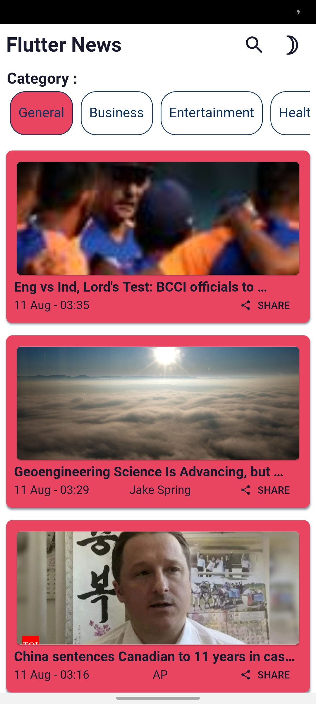
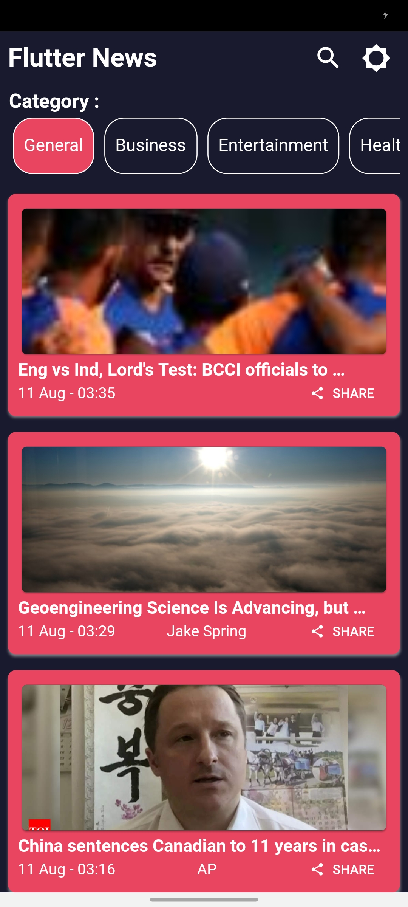
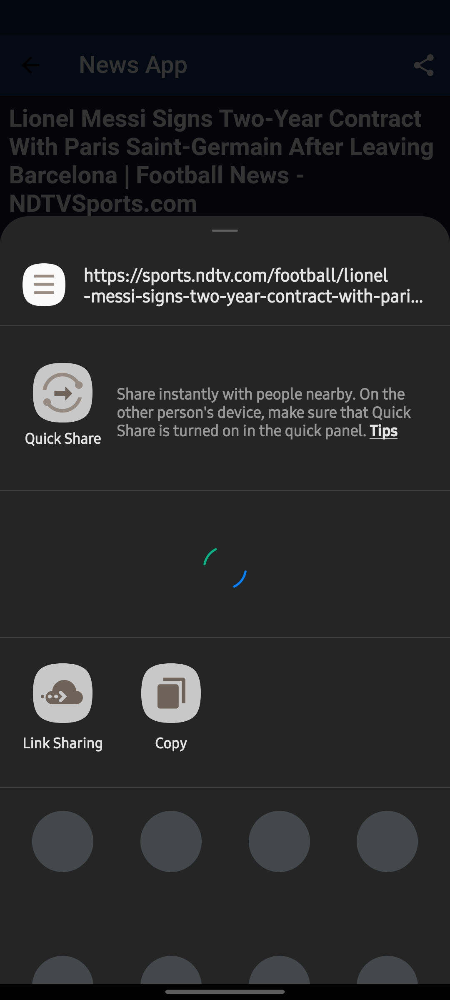

# Flutter News

An android application <h3>Flutter</h3> and <h3>[News Api]</h3>("https://newsapi.org/")

## Getting Started

This is aa api integration project.

Screenshorts
 

A few resources to get you started if this is your first Flutter project:

- [Lab: Write your first Flutter app](https://flutter.dev/docs/get-started/codelab)
- [Cookbook: Useful Flutter samples](https://flutter.dev/docs/cookbook)

For help getting started with Flutter, view our
[online documentation](https://flutter.dev/docs), which offers tutorials,
samples, guidance on mobile development, and a full API reference.
